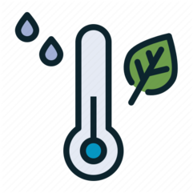
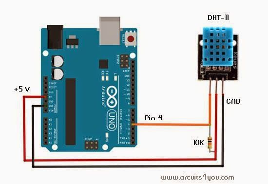

# Arduino temperature and humidity station

 

---
## Table of Contents

- [Description](#description)
- [Technologies](#technologies)
- [Hardware requirements](#Hardware-requirements)
- [How To Use](#how-to-use)
- [License](#license)
- [Author Info](#author-info)

---

## Description
Before you begin you need to have basic knowladge about C language and programing Arduino (in future I will add more detailed instruction).

I wanted to creat a client-server application using Arduino. The application is really simple, client is Arduiono which collects data from DHT11 sensor and it is sending them to the server. Server saves them into the file. I wanted to learn more about UDP and TCP protocol that is why I wrote both of them so do not be suprised if you see UDP in this project (for all that just start learnig about UDP and TCP, UDP is not the greatest protocol for sending and saving that kind of data because many packets can be lost). This project has some drowbacks so do not be shy and change it however you want.   

### Technologies

- TCP
- UDP
- C
- Arduino 

[Back To The Top](#read-me-template)

---
## Hardware requirements
- Arduino with ESP8266
- DHT11 sensor
- contact plate
## How To Use
 - Connect dht11 sensor to your Arduino   
 
 - Program your Arduino with  Arduino IDE (remember to attach ESP8266 libraries) 
 - Compile and run server.c on Linux
 - Enjoy 
---

## License

MIT License

Copyright (c) [2019] [Mateusz Broncel]

Permission is hereby granted, free of charge, to any person obtaining a copy
of this software and associated documentation files (the "Software"), to deal
in the Software without restriction, including without limitation the rights
to use, copy, modify, merge, publish, distribute, sublicense, and/or sell
copies of the Software, and to permit persons to whom the Software is
furnished to do so, subject to the following conditions:

The above copyright notice and this permission notice shall be included in all
copies or substantial portions of the Software.

THE SOFTWARE IS PROVIDED "AS IS", WITHOUT WARRANTY OF ANY KIND, EXPRESS OR
IMPLIED, INCLUDING BUT NOT LIMITED TO THE WARRANTIES OF MERCHANTABILITY,
FITNESS FOR A PARTICULAR PURPOSE AND NONINFRINGEMENT. IN NO EVENT SHALL THE
AUTHORS OR COPYRIGHT HOLDERS BE LIABLE FOR ANY CLAIM, DAMAGES OR OTHER
LIABILITY, WHETHER IN AN ACTION OF CONTRACT, TORT OR OTHERWISE, ARISING FROM,
OUT OF OR IN CONNECTION WITH THE SOFTWARE OR THE USE OR OTHER DEALINGS IN THE
SOFTWARE.

[Back To The Top](#read-me-template)

---

## Author Info

- LinkedIn - [Mateusz Broncel](https://www.linkedin.com/in/mateusz-broncel-339921149/)
- Facebook - [Mateusz Broncel](https://www.facebook.com/profile.php?id=100002577283334)

[Back To The Top](#read-me-template)
